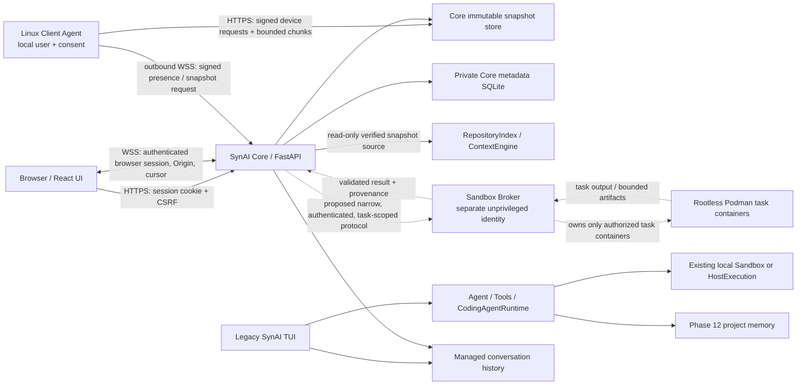

# SynAI 2.0 Architecture Baseline

**Status:** Documentation baseline; execution architecture is not yet approved
for Phase 13F-A implementation. See [the alignment assessment](#phase-13b-13e-alignment-assessment)
and [Phase 13F-A prerequisites](#phase-13f-a-prerequisites).

This is the primary architecture reference for SynAI 2.0. It consolidates the
checked-in Phase 13B–13E implementation notes, the existing agent architecture,
and code inspected in this repository. It distinguishes implemented behavior
from intended future behavior; source code and tests, not UI labels or plans,
are the evidence for implementation status.

The original approved Phase 13A plan and the subsequent distributed
realignment plan were not present in the repository at the time of this
baseline. The checked-in Phase 13B–13E documents report that the revised plan
was unavailable during implementation. No approval record or missing plan is
reconstructed here. The approved trust invariants supplied for this phase are
recorded in [trust boundaries](./trust-boundaries.md); proposed decisions and
their evidence status are recorded in [the ADRs](./adr/).

## 1. Goals and non-goals

### Goals

- Keep the established Linux TUI and its task, approval, execution and
  historical-memory behavior supported.
- Provide an authenticated browser control plane for chat and metadata.
- Represent a distributed project independently from a host path, and bind
  source snapshots to the authorized device and workspace binding that
  supplied them.
- Make snapshot capture an explicit local Client Agent action, and retain only
  bounded, validated, immutable source snapshots in Core.
- Keep future task execution in an independently restricted Broker rather
  than expanding Core or Client Agent authority.
- Preserve provenance and fail closed on ambiguous authorization, stale
  identity, incomplete evidence, cancellation or uncertain execution.

### Non-goals

- The browser is not a remote terminal, file browser, tool dispatcher, or
  device-control surface.
- Browser Chat is not an Agent Task and cannot invoke coding tools.
- Pairing, device presence and workspace binding do not authorize project
  reads or writes by themselves.
- A snapshot is not a live mount, checkout, patch, or proof that it contains
  no secret.
- Core does not execute project code or acquire general host execution
  authority.
- The Client Agent does not execute commands or apply project changes.
- Phase 13F-A and 13F-B behavior is not implemented by this documentation.
- Distributed task execution, patch delivery/application, multi-user project
  ACLs, Windows/desktop clients, and production horizontal scaling are not
  current capabilities.

## 2. System context and component architecture



Solid paths represent functionality present in the current repository;
dashed paths are intended architecture, not available runtime features.
Core and TUI share an exclusive OS data-root lock, so they cannot use the same
data root concurrently. The development Playwright container is test
infrastructure, not a production Core or Broker deployment.

### Component responsibilities and current status

| Component | Responsibilities | Current status |
|---|---|---|
| SynAI Core | Browser authentication; chat-only API and streams; logical projects, device enrollment/authorization, bindings; authenticated Client Agent connections; snapshot validation, immutable storage and read-only source adapter; metadata/activity. | Implemented across Phases 13B–13E. No distributed task execution, claim service, Broker client, or project mutation API. |
| Linux Client Agent | Device key custody; local binding-to-directory association; no-follow bounded preview/capture; explicit per-capture consent; outbound authenticated presence and snapshot upload. | Implemented for Linux snapshots/status only. No shell, patching, Git mutation, or write/execute capability. |
| Sandbox Broker | Separate unprivileged service identity; narrow Core-facing task protocol; task container lifecycle, resource enforcement, claim/fencing checks, cancellation/reaping, result validation. | Planned. No Broker process, Podman integration, or production service identity exists. |
| Task container | Disposable task-scoped execution environment, no network by default, strict filesystem and resource policy. | Planned for distributed tasks. Not the existing legacy TUI Sandbox, whose current network default is bridge and whose selected image/runtime flow is local. |
| Browser | Login, project/device/binding/snapshot metadata, consent-request signaling, chat and activity display. | Implemented. It has no source bytes, local device authority, task execution, patch-apply, or approval-to-execute power. |
| Legacy TUI | Existing chat/tool loop and Phases 1–12 coding-agent workflow through the configured local execution backend. | Implemented and separately supported under its existing security semantics. |
| Core snapshot adapter | Verify manifest and object digests, create/read a Core-owned source view, and expose it to the existing bounded index/context engine. | Implemented as a read-only adapter; not connected to the distributed task runtime. |

Core modules include `synai/web/app.py`, `auth.py`, `chat.py`,
`distributed.py`, `snapshots.py`, `database.py` and `connections.py`.
Client implementation is in `synai/client/`. The original local agent stack
is in `synai/agent.py`, `synai/tools.py`, `synai/coding_agent/`,
`synai/sandbox.py` and `synai/host.py`.

## 3. SynAI Core responsibilities and boundaries

Core is a single-operator, authenticated orchestration/control-plane service.
It owns browser sessions and the private versioned web metadata database.
Separate distributed identities represent logical projects, paired devices,
workspace bindings, snapshots, tasks and future execution targets. Core
creates no project ID from a path and accepts no client-supplied host path in
the distributed API.

The Phase 13B compatibility registry is distinct: it accepts only
operator-configured workspace keys and records host path identity/status for
the legacy read-only project metadata API. It does not expose a file API or
grant mutation or execution authority. Core's existing local process and
operator configuration are still part of the host trust domain; this is not a
claim that Core is a remote, isolated machine.

Core accepts browser Chat through the existing provider and conversation
engine with tools disabled. It authenticates the browser with a server-side
session and CSRF protection. It authenticates devices through a separate
credential/key namespace. A browser identity cannot be used on a device
endpoint, nor a device credential on a browser endpoint.

Core receives only individual bounded snapshot objects, validates them and
stores them separately from conversation history and Phase 12 project memory.
Its snapshot adapter verifies content before read-only indexing/context
selection. Core does not expose snapshot file content to the browser and does
not currently pass the source to a distributed executor.

Core does not own a general execution backend for distributed work. The
`WorkspaceCoordinator` is a future-writer contract for validated Phase 13B
filesystem identities; it is not wired to a write API or to distributed task
claims. The persisted task fencing field does not itself fence a writer.

## 4. Client Agent responsibilities

The Linux Client Agent runs as the invoking local user, initiates outbound
connections and does not open a listener. Pairing generates its Ed25519
private key locally; the private key and device credential are stored in
user-only configuration files. Enrollment creates a pending device and
requires a separate operator authorization action.

The local workspace registry associates a server project/binding ID with a
local directory and filesystem identity. Registering that local binding is
the local user's authorization for bounded reads of that directory to build
a preview. For each capture, the Agent scans and captures file bytes to
produce the preview; explicitly typing `UPLOAD` then consents to transmit
that exact capture to Core. A request delivered over the device connection
can prompt the preview but cannot authorize the local read or transfer; the
read still requires the pre-existing local binding, and non-interactive
execution denies upload consent. The scan is bounded, rejects or excludes
unsafe entries, detects identity/content changes while reading, and transfers
no absolute local path.

The implemented capability is snapshot/status. The Client Agent has no
command execution, patch reception, patch application, or general remote
operation. Any future modification path requires a separate explicit
client-side authorization design and user confirmation; it cannot be inferred
from browser login, pairing, prior snapshot consent, or task approval.

## 5. Sandbox Broker responsibilities

The Broker is a future, separate trust domain. The approved boundary is that
Core may submit only a narrow authenticated task request and must not gain a
Docker/Podman socket or administer runtime objects. The Broker may control
only containers it created and can verify as its own task containers. Its
runtime identity is dedicated and unprivileged; the selected design is
rootless Podman, not the legacy `Sandbox` object or a general-purpose Docker
API proxy.

The Broker independently validates claim, task, immutable snapshot
identity/digest, target, approval/policy references, expiry, limits and
cancellation before side effects. It uses fixed server-side images and
runtime policy, creates disposable task-scoped environments, disables
networking by default, caps CPU/memory/PIDs/storage/time/output and verifies
container ownership. It returns bounded, validated result/artifact metadata
and provenance. No arbitrary host project path is mounted. Failure to
establish the Broker never falls back to host execution.

This describes required behavior, not a current implementation. Transport
identity, durable claim ledger, snapshot retrieval, lease authority,
container policy details and recovery are design-review items; see
[protocol contracts](./protocols.md) and [Phase 13F-A prerequisites](#phase-13f-a-prerequisites).

## 6. Browser and authentication/identity models

The React application authenticates to Core using an HttpOnly, SameSite
session cookie. State-changing requests use an exact configured Origin and
CSRF token. Auth is currently single-user; multi-user identity and per-project
ACLs are not implemented. Chat and project activity WebSockets require the
browser cookie and configured Origin. WebSocket event delivery is
resynchronizable metadata, not authoritative state.

Devices use independent Ed25519 keys and random credentials. Signed device
HTTP requests bind method, encoded path, timestamp, nonce and SHA-256 body
digest; the server enforces credential state/expiry, clock skew and nonce
uniqueness. The outbound device WebSocket uses signed client frames with
sequence, nonce and expiry checks; the server's response frames rely on the
configured TLS/WSS trust chain and sequence validation, not an independent
server signature.

Identity namespaces are not interchangeable:

| Identity | Meaning | Never implies |
|---|---|---|
| Browser session | Authenticated operator session in the current single-user deployment. | Device-local access, a Client Agent consent, or task execution approval. |
| Legacy project ID | Phase 13B configured host-path registration and compatibility state. | A distributed logical project or a remote mount. |
| Logical project ID | Core-generated project identity independent of a path. | A filesystem location, device authorization or source read permission. |
| Device ID | Core-generated identity bound to a public key and device credential. | A project binding, currently active local consent, or execution capability. |
| Workspace binding ID | Association of one logical project and authorized device. | A local path or blanket permission to upload/read/write. |
| Snapshot ID | Immutable captured source objects and manifest for a project, device and binding. | A live workspace, trust in all source content, or write authority. |
| Agent Task ID | Future execution/task identity. | A claim or approval unless those are independently validated. |
| Execution target / Broker allocation ID | Future target and Broker-owned allocation namespaces. | Container authority by possession of an ID. |
| Legacy memory ID | Phase 12 local path/device/inode/user-derived namespace. | Logical project identity or permission to merge/rekey memory. |

## 7. Enrollment, revocation and snapshot transfer/retention

An operator creates a five-minute single-use pairing challenge. The Agent
signs the canonical enrollment payload with its newly created private key.
The Core transactionally consumes the challenge and creates a pending device.
An authenticated operator separately authorizes it. Revocation invalidates
credentials and bindings and closes a live connection; credential rotation
invalidates the previous credential. Forgetting local credentials does not
revoke the server-side identity.

Core verifies each authenticated upload against an active project/device/
binding triple. Client size/hash declarations are expected values; Core
reconstructs the canonical schema-v1 manifest, verifies each object size and
SHA-256, computes total size, and derives the paired-key fingerprint. Content
is transported in ordered, bounded chunks, never as an extracted archive.
Repeated begin, identical chunk and commit operations have documented
idempotency behavior; conflicting reuse is rejected.

Objects are written to private temporary storage and committed into a
Core-owned immutable namespace with the metadata transaction. The collector
expires abandoned uploads and snapshots after bounded retention and does not
substitute a different source on expiry. Queued/claimed task references are
designed to pin a snapshot, but no executable tasks are currently created or
claimed. Snapshot inclusion filters reduce exposure but are not secret
detection; the operator must treat source transfer as disclosure to Core.

## 8. Agent Task lifecycle (planned)

Browser Chat and Agent Tasks are different product/API surfaces. A future
task should bind a logical project, exact source snapshot and digest, source
device/binding provenance, selected target, validated task plan/scope,
approval/policy references, claim and fencing generation, deadlines,
execution state, result and error records. The Agent Task lifecycle is
proposed as:

```text
draft -> validated -> awaiting approval -> queued -> claimed
      -> running -> collecting result -> completed | failed | cancelled
                               \-> interrupted/indeterminate
```

Approval must be explicit and scoped; approval of a project, device, snapshot
request, plan, or one action does not authorize unrelated operations. Claim
and lease validity must be checked by the Broker at execution and supported
mutation boundaries, not only by Core before dispatch. A stale claim must be
rejected. This state machine and claim API are not implemented: current task
records/contracts are identity-only/disabled, execution targets are empty,
and the API advertises `execution_available: false`.

Legacy `CodingAgentRuntime` is a local task engine. It implements planning,
tool mediation, approval callbacks, policy, verification, bounded repair,
review, Git evidence, checkpoints and recovery. It is not distributed and
does not consume a Core task claim or broker allocation.

## 9. Approval and authorization model

Authorization is layered and independent:

1. Browser session authenticates an operator to Core.
2. Operator actions create/authorize/revoke devices, create bindings and
   request a snapshot; these are Core metadata permissions only.
3. A local user authorizes a directory and approves the exact snapshot preview
   before local reads and upload.
4. Legacy TUI tool calls use its `Tools` dispatcher, strict schemas, backend
   identity, Phase 10 policy, per-action approval, task plan/scope and
   preimage checks.
5. Future distributed execution requires separately validated task
   authorization, approval reference, claim and Broker policy. None can be
   synthesized from a browser session or Client Agent credential.
6. Future client-side patch application requires a separate local authorization,
   exact artifact/provenance validation and local confirmation.

Current Core endpoints do not approve or dispatch coding tools. Browser chat
uses the existing `Agent` with tool execution disabled and rejects model
tool calls. Legacy autonomy policy remains local and independently enforced;
the policy mode does not remove mandatory approval for sensitive operations.

## 10. Task coordination, fencing and provenance

The Phase 13B `WorkspaceCoordinator` uses canonical host workspace identity,
OS locks, monotonic generations and hashed fencing tokens. A token must be
validated against current persisted authority immediately before a write.
Crashes require trusted recovery evidence proving all prior writers stopped.
These contracts are not connected to distributed task execution. The
distributed-task table's `fencing_generation` is a field, not an enforcement
mechanism; no public task claim/recovery API exists.

Task artifacts and patches must eventually link to task ID, claim ID and
generation, source snapshot ID plus manifest digest, policy and approval
references, execution target/allocation, tool/action identity, output digest,
and result status. Legacy Phase 9 records contain local task mutation
evidence, private before/after content references, bounded diffs and Git
inspection provenance. Those local records are not a distributed artifact
contract and must not be represented as Broker evidence.

## 11. Client-side patch application (planned)

No patch-application protocol or endpoint exists. The future design must not
push writes to a device automatically. A patch is an untrusted artifact until
Core/Broker provenance, task/snapshot binding, path and digest constraints,
policy/approval references and result integrity have been validated. The
Client Agent must preview exact paths and changes, revalidate the local
binding and preimages, obtain a fresh local user confirmation and apply only
within the explicitly authorized directory. It must generate a durable local
receipt identifying artifact/task/snapshot, before/after digests, outcomes,
time and any conflicts. A conflict or uncertain result must stop; it must not
force, partially misreport, or replay the operation. Exact atomic-write,
rollback and partial-application design remains for a later reviewed phase.

## 12. Failure, cancellation and recovery

Existing behavior: browser-chat turns are cancellable, retain partial state,
and are marked interrupted on recovery without resubmitting. Browser event
reconnection replays persisted cursors or requests an authoritative refresh.
Client snapshot transfer is bounded and requires new preview/consent after
uncertain process loss; it is not automatically resumed after restart.
Legacy task and tool recovery marks uncertain executions interrupted and
never replays them automatically. Local helper cleanup is bounded but is not
a distributed Broker guarantee.

Required future behavior: cancellation is an authenticated idempotent request
bound to an active claim and unguessable handle. The Broker must stop and reap
all writers before releasing a claim or lease. A timeout, disconnected Core,
Broker restart, lost acknowledgment, uncertain write, or failed reaping
produces an indeterminate/blocked state requiring explicit reconciliation;
it cannot silently retry, fall back to host execution, or claim success from
process exit alone. Recovery evidence must bind the exact prior task, claim,
generation and container, and prove the previous writer is stopped before
new authority is issued.

## 13. Legacy TUI, Phase 12 memory and compatibility

The TUI remains a separate supported application under its existing
semantics. It uses its existing conversation `Agent`, `Tools`, sandbox or
explicit HostExecution backend, task policies, approvals and memory. Those
local execution backends are not the future Broker. Browser and TUI share a
single-process data-root lock; simultaneous use of one data root is rejected.

Phase 12 project memory remains opt-in, local and workspace-identity-bound.
Its ID derives from user, device/inode and canonical path; a Core snapshot
logical project is not an alias. Phase 13C includes a preview-only memory
association contract, not a migration or live memory integration. Do not
change historical conversation, checkpoint, task or memory schemas as part of
this architecture baseline. No automatic migration, namespace merge or
historical evidence reclassification is authorized.

The Phase 13B path-based project registry remains a legacy compatibility
domain; logical distributed projects are separate records and are not
backfilled from it. See [phase compatibility](./phase-compatibility.md) and
the ADR on historical memory.

## 14. Docker deployment and runtime boundaries

The web service is currently designed as one process per data root and uses
an exclusive OS lock. Multi-worker/multi-process use of the same root is not
supported. It defaults to loopback and requires HTTPS-origin configuration
for remote use; a protected reverse proxy and firewall are recommended.
Metadata and snapshots are private application-owned storage. The repo does
not define a production Core image or deployment manifest. The documented
digest-pinned Playwright container is test-only and has no host workspace or
runtime socket.

Core must not mount arbitrary host/client project paths or receive an
unrestricted Docker/Podman socket. A Broker may use rootless Podman only
within its own unprivileged service identity and may administer only
containers it created and can verify as owned. It must not control Core,
TUI, unrelated system containers, or client devices. The local TUI's
configurable `Settings.runtime`, existing `Sandbox` and `HostExecution` do
not inherit the Broker trust guarantees.

## 15. Extensibility

Future workers, GPU targets and Android clients must be represented as
separate, typed execution targets/capabilities and authenticated identities.
Capability advertisements are untrusted metadata, not authorization or proof
of enforcement. Each target requires its own threat model and independently
enforced restrictions; adding a target cannot weaken the default Broker
policy, Core separation, local-consent boundary, snapshot provenance or
no-replay recovery semantics. Android, GPU, remote worker and general task
protocol support are not implemented.

## 16. Phase 13B–13E alignment assessment

### Confirmed alignment

- Browser and device identities are separate; the Core's device API requires
  signed device proof, and browser auth is cookie/CSRF based.
- Logical project/device/binding/snapshot IDs are opaque and separated from
  legacy path-based projects and Phase 12 memory IDs.
- Browser Chat explicitly disables tools. No code path passes browser chat to
  `CodingAgentRuntime`.
- The Linux Client Agent scans only locally registered paths, presents
  preview and requires per-snapshot consent.
- Snapshot ingestion validates paths, types, limits, UTF-8 and content
  digests; Core constructs the committed manifest and stores source objects
  separately.
- No task execution, Broker target or patch-application route is enabled.
- Workspace coordinator code is a future-writer primitive, not an active web
  mutation route. Uncertain local task/checkpoint operations are not replayed
  automatically.

### Confirmed discrepancies and risks

| ID | Severity | Finding | Evidence/status | Required resolution |
|---|---|---|---|---|
| A1 | High | The repository does not contain the original approved Phase 13A plan or later realignment approval record. Checked-in Phase 13B explicitly says the revised plan was unavailable. Therefore approval provenance and any unrecorded decision details cannot be verified. | Documentation gap; not a claim of code violation. | Recover and version the actual plan/approval record, or explicitly approve this baseline before implementation. |
| A2 | High | Distributed task claims and fencing are not operational. `distributed_tasks` has claim/generation columns and a disabled task-contract helper, but no claim/renew/release/recover API or Broker enforcement exists. WorkspaceCoordinator operates on configured legacy workspace identities and is not wired to these records. | Blocks safe 13F-A implementation until the authority and recovery protocol are specified and independently tested. | Design and review the authenticated durable claim, fencing authority, mutation enforcement and crash-recovery protocol. |
| A3 | High | No Sandbox Broker exists. Reusing the local TUI `Sandbox` as a Broker would violate the intended separation: it calls the configured runtime CLI, accepts an image argument, uses bridge networking for created containers and binds the local selected workspace read-write. `HostExecution` is explicitly host execution. | No current distributed execution feature; local legacy behavior is not itself a distributed violation. | Implement the separate unprivileged rootless-Podman Broker under all prerequisites; never route Broker failure to these local backends. |
| A4 | Medium | The 13B compatibility registry still represents configured host directories and validates their filesystem identity in the Core process. It is read-only metadata and must remain isolated from distributed logical-project/snapshot processing. | Implemented legacy compatibility surface; not a client path supplied by browser. | Keep it disabled from task execution and retain explicit tests that distributed APIs never resolve or mount these paths. |
| A5 | Medium | The single-user service has no project ACL model. Authenticated browser operations are effectively operator-wide, not multi-tenant isolation. | Documented deployment assumption, not a multi-user guarantee. | Before multiple users/tenants, add explicit project authorization and object-level checks for every route and stream. |
| A6 | Medium | Snapshot filters are heuristic; neither preview nor extension/path exclusions prove secret absence. Core intentionally receives and retains approved source content. | Documented and intrinsic limitation. | Keep transfer disclosure clear; consider optional secret-scanning/redaction only with explicit UX and no claim of completeness. |
| A7 | Low | Agent Tasks and Sandboxes are metadata/transparency pages and execution-target status endpoints only. Labels must not be mistaken for an operational queue or sandbox. | UI and API mark execution unavailable. | Maintain the explicit unavailable status until a reviewed Broker integration ships. |
| A8 | Low | Rootless Podman, Core/Broker identities, image digests and production deployment boundaries have no production manifests or integration evidence. | Design/deployment evidence absent. | Add deployment-specific acceptance tests and reviewed manifests before production claims. |

No Critical source-code trust-boundary violation was confirmed in the reviewed
13B–13E path. The High findings are nonetheless blocking discrepancies for
Phase 13F-A; this baseline is **not approved** as an implementation-ready
execution architecture until they are resolved.

### Missing or unverified security guarantees

- No production Core deployment/image/UID/mount review, Broker service
  identity or rootless Podman integration exists.
- No task claim ledger, claim expiry/renewal, stale-fence rejection, result
  validation or recovery proof is implemented.
- No distributed authorization/approval issuance model or multi-user ACL is
  present.
- No guarantee exists that transferred source is free of secrets or malicious
  prompt-injection content.
- No client-side patch format, validation, application or receipt mechanism
  exists.
- No runtime protocol attests that a target actually enforces advertised
  capability limits.
- No automated tests can prove security of a future production deployment
  from the current test-only containers.

## 17. Phase 13F-A prerequisites

Before implementation is accepted, the Broker design and tests must meet
every required criterion in [trust boundaries](./trust-boundaries.md) and
[protocol contracts](./protocols.md):

1. Dedicated unprivileged Broker OS identity, separated from Core and TUI.
2. Rootless Podman ownership boundary; Broker controls only its own
   task-scoped containers.
3. No Core access to an unrestricted Docker/Podman socket or runtime
   administration API.
4. Server-side allowlisted images pinned by immutable digest; no caller-
   selected image or mutable tag.
5. Task-scoped authenticated claims binding task, claim, project, snapshot
   digest, target, approval/policy references, expiry and fencing generation.
6. Retrieval only of the exact immutable Core snapshot; verify manifest and
   every object digest before execution.
7. Independent Broker enforcement of tool/action, mount, target and execution
   limitations; Core checks alone are insufficient.
8. Network disabled by default; any exception must be explicit, narrow and
   separately approved.
9. Enforced CPU, memory, PID, storage, wall-time and output ceilings.
10. Verify container ownership before inspect/exec/cancel/remove; never target
    a foreign runtime object.
11. Authenticated cancellation, process/container reaping, crash recovery
    evidence and no automatic replay of uncertain operations.
12. Validate bounded results and artifact provenance against the exact
    request/claim/snapshot before reporting success.
13. No unauthorized host workspace mount, client path, device, host namespace,
    privileged mode or host-execution fallback.
14. Broker outage, invalid result, timeout or uncertain state fails closed;
    never fall back silently to Core or `HostExecution`.

**Approved invariants:** control/execution separation, no unrestricted Core
runtime socket, no arbitrary Core host/client workspace mounts, immutable
authorized snapshot storage, independent local Client Agent authorization,
no browser-to-device authority, task-scoped disposable execution,
independent policy/approval/target checks, no automatic patch application,
no replay of uncertain operations, and separate legacy TUI compatibility.

**Still requiring design review:** exact Core/Broker transport and identities;
claim ledger durability and fencing authority; expiry/renewal and cancellation
semantics; snapshot fetch authorization and digest envelope; pinned-image
build/provenance/refresh process; concrete resource ceilings; mount layout
and writable-layer/export policy; network exceptions; container labels and
ownership verification; result/artifact schema, integrity and retention;
crash reaping/recovery evidence; production deployment/monitoring and
acceptance tests. Approval of the invariants is not approval of these
implementation details.

## 18. Source and test evidence

Architecture and phase documentation: [agent architecture](../agent-architecture.md),
[13B](../phase-13b-web.md), [13C](../phase-13c-distributed.md),
[13D](../phase-13d-web-chat.md), [13E](../phase-13e-client-agent.md).

Representative tests: `tests/test_web_foundation.py`,
`tests/test_web_distributed.py`, `tests/test_client_agent.py`,
`tests/test_web_chat.py`, `tests/test_web_coordination.py`,
`tests/test_web_container_isolation.py`,
`tests/test_web_container_memory_identity.py`,
`tests/test_coding_agent_runtime.py`, `tests/test_coding_agent_policies.py`,
`tests/test_coding_agent_changes.py`, `tests/test_coding_agent_checkpoints.py`,
`tests/test_coding_agent_memory.py`, `tests/test_host.py` and
`tests/test_storage.py`. Presence of tests is evidence for their tested
fixtures and assertions only; it is not proof of production deployment
security or future Broker behavior.
